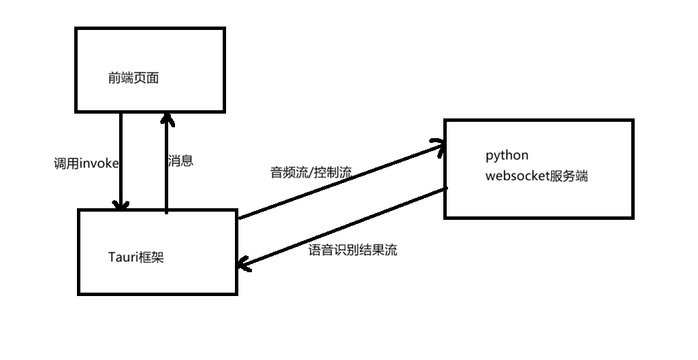

[中文介绍](README2.md) | [English](README2_EN.md)

## 缘起
做这个项目最初是看到了国外一个创业项目叫做Monologue，是运行在苹果系统上的语音输入软件，它最大的特点就是用户界面做的非常优雅，遗憾的是没有windows版，所以我就想做一个windows版的。

2025年可以说是AI大模型的元年，deepseek R1于一月份发布以来各家模型如雨后春笋般出现，氛围编程vibe coding概念走红。

2025年10月1日国庆节期间我通过vibe coding完成了第一个版本，用python完成，界面十分丑陋。基于python的应用有两个问题：
一个是用户界面不好看；另一个是打包成安装包困难。

于是，为了好看的界面，为了跨平台，为了方便打包，我准备开发跨平台版本。

多方对比，我觉得目前基于Rust的tauri框架是跨平台最好的选择，因为它可以方便地打成安装包，可以利用html/css/javasript开发出精美图形界面。

于是，开始了一场和Rust的冒险。

在开发过程中，趟了不少坑，比如······（为了节省各位大大的时间，中间省略一万字）。

最终，做出了这么一个应用，我给他起名Monobuck，只需要按下快捷键就可以进行语音输入，语音识别后文本输入大语言模型进行规范化处理（这么做的目的是让输出的文本直接可用，减少修改），然后输出到当前的光标位置。

它的架构是这样的：

- 前端：使用原生HTML/CSS/JAVASCRIPT，创建用户界面。
- 后端：基于python开发，实现本地语音识别+远程语音识别，自由切换。
- 中间：使用tauri框架，负责沟通前端和后端，在两者之间传递消息。
图解：

## 功能演示
两种操作方式：1、按下ctrl+win键开始录音，松开结束；2、双击ctrl键开始录音，再次单击ctrl键结束录音。

https://github.com/user-attachments/assets/abfacdaf-51ce-4c54-9da5-f29755435b10

## 如何使用
要运行代码，首先得配置python环境，推荐使用uv进行环境管理：
在mono_core文件夹里运行：
`
uv init .
uv sync
`
打包python：
python build_websocket_server.py 

打包后生成的websocket_server.exe会自动放到 src-tauri\resources\websocket_server.exe，将作为后端服务和tauri一起打包。
如果没有这个文件，就不能进行语音识别。

在项目根目录初始化node环境：
npm run install

调试：
npm run tauri dev

打包：
npm run tauri build

打包后文件在src-tauri\target\release目录下。

