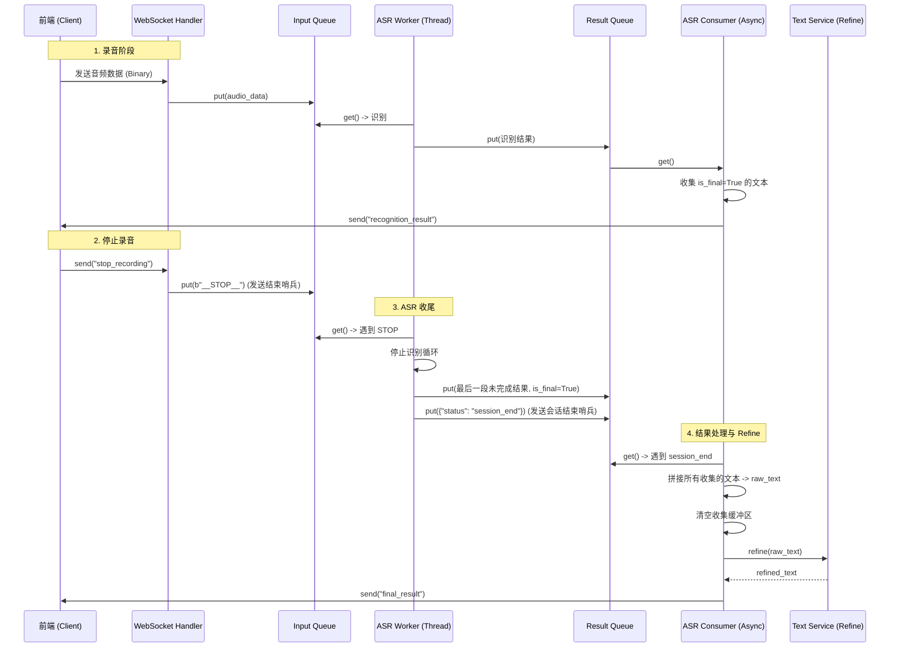

# ASR 识别与 Refine 流程逻辑说明

本文档详细描述了后端 `websocket_server.py` 中关于语音识别（ASR）、结果处理、会话结束以及最终文本润色（Refine）的处理逻辑。

## 1. 核心设计目标

该流程旨在解决以下关键问题：
*   **消除竞态条件**：确保在触发 Refine（润色）之前，所有的 ASR 识别结果（包括最后一段音频的结果）都已被完整接收和处理。
*   **数据完整性**：防止上一轮会话的残留数据污染下一轮会话，或因过早清空缓冲区导致数据丢失。
*   **异步解耦**：将耗时的 ASR 推理和 LLM 润色操作与 WebSocket 消息收发解耦，保证服务响应速度。

## 2. 流程概览

整个流程基于 **生产者-消费者** 模型，通过两个队列 (`input_queue`, `result_queue`) 和两个主要执行单元 (`ASR Worker`, `ASR Consumer`) 协作完成。



## 3. 详细逻辑步骤

### 3.1 音频接收与 ASR 识别 (ASR Worker)

*   **输入**：`ASR Worker` 线程不断从 `input_queue` 读取音频数据。
*   **识别**：调用 `asr.transcribe_stream` 进行流式识别。
*   **中间结果**：识别过程中产生的中间结果（`is_final=False`）和句末结果（`is_final=True`）都会被放入 `result_queue`。
*   **停止信号**：当从 `input_queue` 读到 `b"__STOP__"` 时，`queue_iter` 生成器结束，导致 `transcribe_stream` 循环退出。

### 3.2 会话结束处理 (ASR Worker)

当一轮识别循环结束（即收到停止信号后），Worker 会执行以下关键操作：

1.  **强制提交最后片段**：检查是否有最后一段未标记为 `is_final` 的识别结果（通常是用户说完话但 VAD 还没断句的情况）。如果有，将其强制标记为 `is_final=True` 并放入 `result_queue`。
2.  **发送结束哨兵**：向 `result_queue` 放入一个特殊消息 `{"status": "session_end"}`。**这是触发后续 Refine 流程的唯一可靠信号。**

```python
# websocket_server.py (ASR Worker 部分)
if last_part and last_part.get("text"):
    last_part["is_final"] = True
    result_queue.put(last_part)

# 发送会话结束标记
result_queue.put({"status": "session_end"})
```

### 3.3 结果消费与 Refine 触发 (ASR Consumer)

`ASR Consumer` 是一个异步协程，负责从 `result_queue` 读取消息并处理：

1.  **普通识别结果**：
    *   如果消息包含 `text`，将其发送给前端。
    *   **关键逻辑**：只有当 `is_final=True` 时，才将文本追加到 `session_text_list` 列表中。这避免了中间结果重复拼接的问题。

2.  **会话结束消息 (`session_end`)**：
    *   当收到此消息时，意味着 `result_queue` 中该会话的所有识别结果都已处理完毕。
    *   **拼接文本**：将 `session_text_list` 中的所有句子用句号拼接成 `raw_text`。
    *   **清空缓冲**：立即清空 `session_text_list`，为下一轮会话做准备。
    *   **执行 Refine**：调用 `text_service.refine(raw_text)`（在线程池中运行，避免阻塞）。
    *   **发送最终结果**：将 `raw_text` 和 `refined_text` 封装在 `final_result` 消息中发送给前端。

```python
# websocket_server.py (ASR Consumer 部分)
if part.get("status") == "session_end":
    # 触发 Refine 逻辑
    raw_text = "。".join(session_text_list)
    session_text_list.clear() # 清空，准备下一次
    
    if raw_text:
        # ... 执行 Refine ...
        refined_text = await asyncio.to_thread(text_service.refine, raw_text)
        # ... 发送 final_result ...
    continue
```

### 3.4 停止录音指令的处理

前端发送 `stop_recording` 指令时，服务器端的处理逻辑非常简单，只做一件事：

*   向 `input_queue` 放入 `b"__STOP__"`。

**注意**：此处**不**直接进行 Refine 或操作 `session_text_list`。所有的后续操作都由数据流在 `ASR Worker` 和 `ASR Consumer` 之间自然传递触发，从而彻底消除了竞态条件。

## 4. 总结

这套逻辑的核心在于利用 **队列的先进先出 (FIFO)** 特性，将“结束信号”作为数据流的一部分传递。

*   `__STOP__` 在音频数据之后，确保 ASR 处理完所有音频。
*   `session_end` 在识别结果之后，确保 Consumer 收集完所有文本。

这样无论系统负载如何，处理顺序永远是：`音频处理` -> `最后结果提交` -> `文本收集` -> `Refine`，保证了逻辑的严密性。
